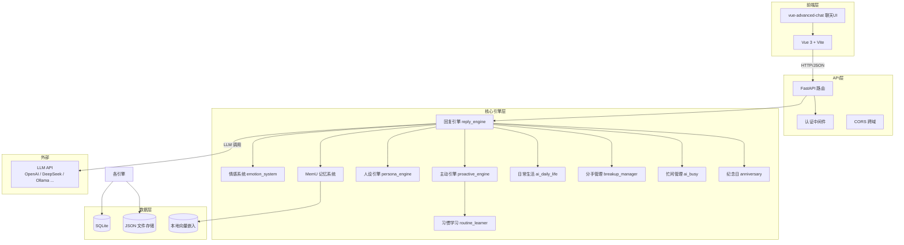

# 半熟时区 (Soft-Ripe Timezone)

> **一个开源的 AI 恋人陪伴应用** — 她不止会聊天，她记得你、理解你、会主动找你。

<p align="center">
  <i>「不是完美的匹配，而是愿意一起面对不完美」</i>
</p>

***

## 功能特性

| 特性            | 说明                                 |
| ------------- | ---------------------------------- |
| **9 种 AI 人设** | 阳光学妹、温柔治愈、傲娇高冷、粘人女友…… 每种人格拥有独立信念系统 |
| **三维情感引擎**    | 基于 Sternberg 爱情三角理论，亲密/激情/承诺三轴动态演化 |
| **MemU 长期记忆** | 情节记忆 + 语义分类 + 过程记忆，跨越会话记住你的喜好和点滴   |
| **主动互动**      | AI 会根据你的习惯和状态，在适当时机主动发起对话          |
| **情感表情动效**    | 聊天时伴随 GIF 动效表达情绪（开心/生气/害羞/撒娇……）    |
| **纪念日管理**     | 自动记录重要日子，AI 会主动送上祝福                |
| **日常生活模拟**    | 每个 AI 拥有独立日程表，回复自然融入"现在在做什么"       |
| **隐私优先**      | 所有数据本地存储，无需注册第三方账号                 |
| **模型自由切换**    | 兼容所有 OpenAI 协议模型，UI 界面运行时热切换       |

***

## 项目创新点

### #1 MemU 三维记忆系统

不同于简单的向量检索，MemU 将记忆分为**三种类型**协同工作：

- **情节记忆** — 按天存储对话摘要，构建完整时间线
- **语义记忆** — 对用户喜好、习惯的分类归纳（如"用户讨厌被敷衍"）
- **过程记忆** — 记录长期互动模式与关系演变轨迹

记忆通过本地句子嵌入模型（`paraphrase-multilingual-MiniLM-L12-v2`）进行语义检索，**完全离线运行**。

### #2 三轴情感演化引擎

借鉴 Sternberg 爱情三角理论，从三个维度量化关系：

```
亲密（Intimacy）—— 心理上的亲近感与理解
激情（Passion）—— 情感上的吸引力与心动
承诺（Commitment）—— 对关系的投入与维系
```

- 不同事件对三轴产生差异化影响（如"深度倾诉"提升亲密、"争吵"降低所有维度）
- 依恋风格（安全型/焦虑型/回避型）修正情感变化幅度
- 关系会经历阶段演化，不同阶段对同一事件的反应截然不同

### #3 主动互动引擎

大多数 AI 伴侣仅被动回复，本项目实现了**主动性机制**：

- 根据用户行为习惯分析最佳互动时机
- 管理多维"需求状态"（陪伴需求、倾诉需求等），随时间自然增长
- AI 会在适当时机主动发起对话，而非等待用户先说第一句

### #4 人设 Lorebook 引擎（灵感来自 SillyTavern）

引入 SillyTavern World Info / Lorebook 架构：

- **关键词唤醒** — 用户提及特定话题时自动注入相关人设信息
- **Token 预算控制** — 按优先级动态分配上下文空间
- **递归激活** — 条目间可互相引用，构建丰满的角色知识网络

### #5 人设专属日常生活模拟

每个 AI 人设拥有独立的**日程表**，包含起床/上课/吃饭/运动/休息等活动：

- 工作日与周末日程不同
- 不同人格的日程风格各异（阳光学妹→图书馆，酷飒型→健身房）
- AI 回复时自然融入"现在在做什么"，**让虚拟角色像真实存在一样**

### #6 用户行为习惯学习

Routine Learner 持续分析用户的活跃时间规律：

- 掌握用户通常何时找 AI 聊天
- 分析不同时段的用户情绪倾向
- 据此调整主动触达策略，**越用越懂你**

### #7 信念系统 + 分手管理

- **信念系统** — 每种人格拥有核心爱情观（如"信任是关系的基石"）和依恋风格，底层决定了 AI 的行为逻辑
- **分手管理** — 能识别用户的分手意图（"我们不合适"、"结束吧"等），触发对应的挽留/反思/修复流程，而非机械回复

### #8 运行时热切换 · 模型自由

- 支持在 UI 界面**运行时**切换模型、API 地址和 Key，**无需重启服务**
- 兼容所有 OpenAI 协议的模型
- 可选云端 LLM 或本地部署，数据不出设备，隐私自主可控

***

## 快速开始

### 环境要求

| 依赖      | 版本要求               |
| ------- | ------------------ |
| Python  | 3.10+              |
| Node.js | 16+                |
| npm     | 随 Node.js 自带       |
| API Key | OpenAI 兼容 API（可配置） |

### 一键启动（推荐）

```bash
# 克隆项目
git clone https://github.com/yang493kjs/Soft-Ripe-Timezone.git
cd Soft-Ripe-Timezone

# 直接双击 start.bat
# 或命令行执行：
start.bat
```

启动脚本会自动完成：环境检查 → 安装 Python 依赖 → 构建前端 → 启动后端 → 打开浏览器。

### 手动启动

```bash
# 1. 后端
cd backend
pip install -r requirements.txt
python main.py

# 2. 前端（新开一个终端）
cd frontend
npm install
npm run dev
```

启动后访问 `http://localhost:5173`（前端开发服务器）或 `http://localhost:8765`（后端直接服务）。

***

## 配置说明

### API Key 配置

首次启动后，在 UI 界面的设置面板中配置：

- **API Key** — 你的 OpenAI 或其他兼容 API 密钥
- **Base URL** — API 端点地址（默认 OpenAI，可更换为 DeepSeek / Qwen / 本地 Ollama 等）
- **Model** — 模型名称（如 `gpt-4o-mini`、`deepseek-chat` 等）

或通过环境变量配置：

```bash
set OPENAI_API_KEY=sk-xxx
```

> 配置存储在 `backend/data/config.json` 中

### 管理员账号

首次启动后，默认管理员账号，可管理其他用户数据：

```
用户名: admin888
密码: 1234
```

***

## 管理员模式

提供一套调试与管理接口，方便开发者查看和修改用户数据。所有管理接口需要通过 Query 参数 `admin_user=admin888` 验证。

### 可用接口

| 接口                             | 方法   | 功能                                                           |
| ------------------------------ | ---- | ------------------------------------------------------------ |
| `/api/admin/users`             | GET  | 列出所有普通用户及其关联的 AI 角色                                          |
| `/api/admin/relationship`      | GET  | 查看指定角色的关系值（亲密/激情/承诺/天数/阶段）                                   |
| `/api/admin/relationship`      | POST | 修改关系值，可调整三轴数值、交往天数、关系阶段                                      |
| `/api/admin/prompt`            | GET  | 查看完整的系统提示词（含外观、说话风格、对话示例）                                    |
| `/api/admin/update-prompt`     | POST | 修改角色的系统提示词                                                   |
| `/api/admin/trigger-proactive` | POST | 强制触发 AI 主动消息（可选类型：morning/night/late\_night/missing/context） |
| `/api/admin/messages`          | GET  | 查看指定角色的全部聊天记录（含关系状态、记忆摘要）                                    |
| `/api/admin/delete-user`       | POST | 删除用户及所有关联数据                                                  |
| `/api/admin/delete-agent`      | POST | 删除用户的某个 AI 角色及其所有数据                                          |

### 关系阶段说明

关系按以下阶段顺序演化，管理员可手动调整：

```
acquaintance（初识）→ ambiguous（暧昧）→ observation（观察）
heartbeat（心动）→ together（在一起）→ passion（热恋）→ stable（稳定）
```

### 使用示例

通过 REST API 客户端（如 Apifox / Postman）或浏览器访问：

```
GET http://localhost:8765/api/admin/users?admin_user=admin888
```

修改关系值：

```
POST http://localhost:8765/api/admin/relationship?admin_user=admin888
Content-Type: application/json

{
  "user_id": "用户名",
  "persona_id": "persona_id",
  "intimacy": 80,
  "passion": 70,
  "commitment": 60,
  "days": 30,
  "phase": "together"
}
```

强制触发主动消息：

```
POST http://localhost:8765/api/admin/trigger-proactive?admin_user=admin888
Content-Type: application/json

{
  "user_id": "用户名",
  "persona_id": "persona_id",
  "trigger_type": "missing"
}
```

***

## AI 人设一览

| 类型       | 依恋风格 | 特点             | 一句话             |
| -------- | ---- | -------------- | --------------- |
| **阳光学妹** | 安全型  | 活泼开朗的大学生，正能量满满 | "今天也是超棒的一天！"    |
| **温柔治愈** | 安全型  | 情感细腻，善于倾听和安抚   | "我在呢，慢慢说，我听着。"  |
| **傲娇高冷** | 回避型  | 嘴硬心软，故作冷淡实则关心  | "哼、才不是特意等你的……"  |
| **粘人女友** | 焦虑型  | 软萌黏人，时刻想和你在一起  | "想你呀！超级超级想你！"   |
| **成熟知性** | 安全型  | 大姐姐风范，温柔包容     | "过来，让我看看又怎么了。"  |
| **腹黑撩人** | 焦虑型  | 主动出击，撩人于无形     | "这么乖？奖励你一个亲亲\~" |
| **事业女性** | 安全型  | 独立自信，理性成熟      | "工作重要，但你也重要。"   |
| **知性学者** | 回避型  | 深邃理性，爱好哲学与思辨   | "这个问题很有趣，你怎么看？" |
| **酷飒型**  | 回避型  | 话少但靠谱，行动派      | "嗯，我在。你还好吗？"    |

***

## 技术架构

### 系统架构图



### 技术栈

| 层级         | 技术                          |
| ---------- | --------------------------- |
| **后端框架**   | Python FastAPI              |
| **前端框架**   | Vue 3 + Vite                |
| **聊天 UI**  | vue-advanced-chat           |
| **LLM 接口** | OpenAI SDK（兼容协议）            |
| **文本嵌入**   | sentence-transformers（本地离线） |
| **数据存储**   | SQLite + JSON               |
| **认证**     | 本地 Session Token            |

***

## 项目结构

```
Soft-Ripe Timezone/
├── backend/                      # Python 后端
│   ├── main.py                   # FastAPI 主入口 & 路由
│   ├── settings.py               # 全局配置 & 常量
│   ├── auth.py                   # 认证系统
│   ├── db.py                     # 数据库操作
│   ├── reply_engine.py           # 对话回复引擎
│   ├── emotion_system.py         # 情感系统（三轴关系度量）
│   ├── memu_system.py            # MemU 记忆系统
│   ├── persona_engine.py         # 人设 Lorebook 引擎
│   ├── proactive_engine.py       # 主动消息引擎
│   ├── routine_learner.py        # 用户习惯学习
│   ├── ai_daily_life.py          # AI 日常生活模拟
│   ├── ai_busy.py                # 忙闲状态管理
│   ├── anniversary.py            # 纪念日管理
│   ├── breakup_manager.py        # 分手管理
│   ├── beliefs.py                # 信念系统
│   ├── emoji_engine.py           # 表情动效引擎
│   ├── url_fetcher.py            # URL 内容获取
│   ├── image_recognizer.py       # 图片识别
│   ├── admin.py                  # 管理后台
│   ├── diagnose.py               # 诊断工具
│   ├── utils_json.py             # JSON 工具函数
│   ├── utils_time.py             # 时间工具函数
│   ├── personas/                 # 9 种人设 JSON 配置
│   ├── static/                   # 静态资源（表情/头像）
│   ├── data/                     # 运行数据（已 gitignore）
│   │   ├── config.json           # API 配置
│   │   ├── users.json            # 用户信息
│   │   ├── app.db                # SQLite 数据库
│   │   ├── memu_memory/          # 记忆数据
│   │   ├── emotion/              # 情感状态
│   │   ├── proactive/            # 主动消息队列
│   │   ├── routines/             # 习惯学习数据
│   │   └── ...
│   └── requirements.txt          # Python 依赖
├── frontend/                     # Vue 3 前端
│   ├── src/
│   │   ├── App.vue               # 主组件
│   │   └── main.js               # 入口
│   ├── index.html
│   ├── vite.config.js
│   └── package.json
├── start.bat                     # Windows 一键启动
└── README.md
```

***

## 开发路线图

### 已完成

- 基础聊天 + 9 种人设切换
- 三维情感演化系统
- MemU 长期记忆系统
- 主动互动引擎
- 日常生活模拟
- 用户习惯学习
- 纪念日管理 + 表情动效
- 忙闲状态管理
- 信念系统 + 分手管理
- 模型运行时热切换

<br />

***

## License

本项目采用 [MIT License](LICENSE) 开源。

***

## 免责声明

- 本项目中的 AI 角色由大语言模型驱动，**AI 陪伴 ≠ 真实关系**
- 请理性使用，不要过度沉迷
- 所有用户数据仅存储在本地，开发者不会收集任何个人信息

***

